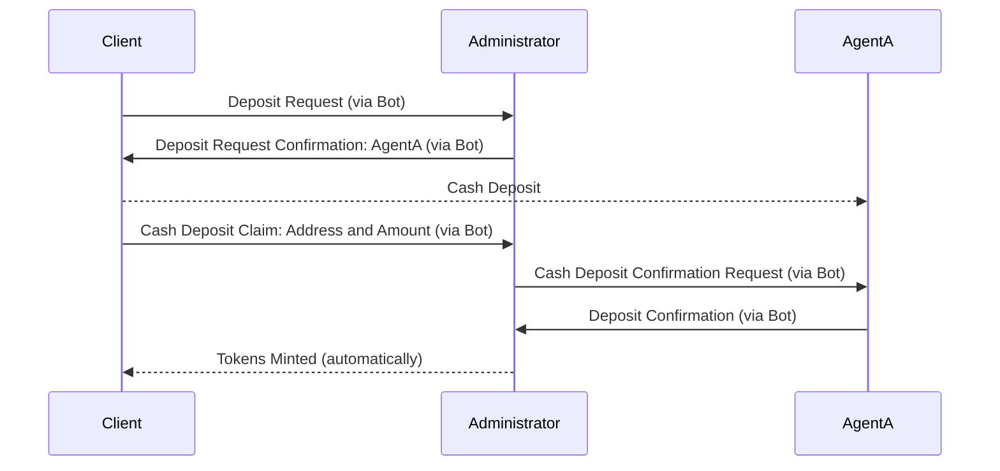
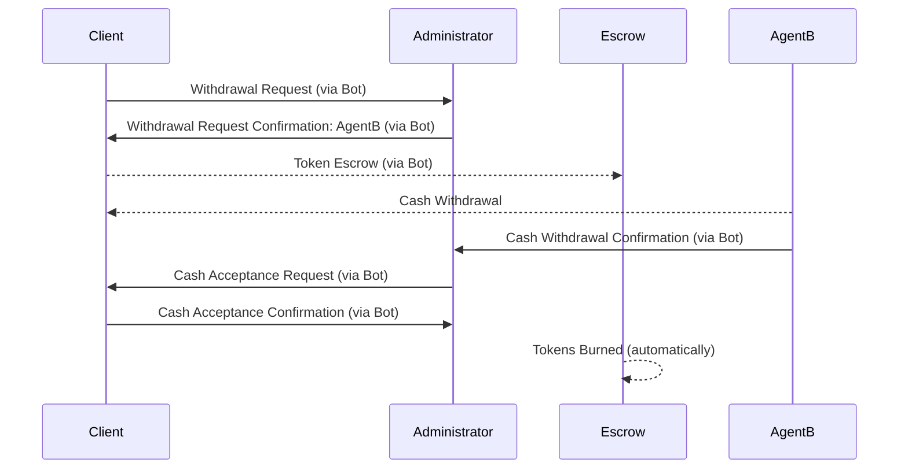
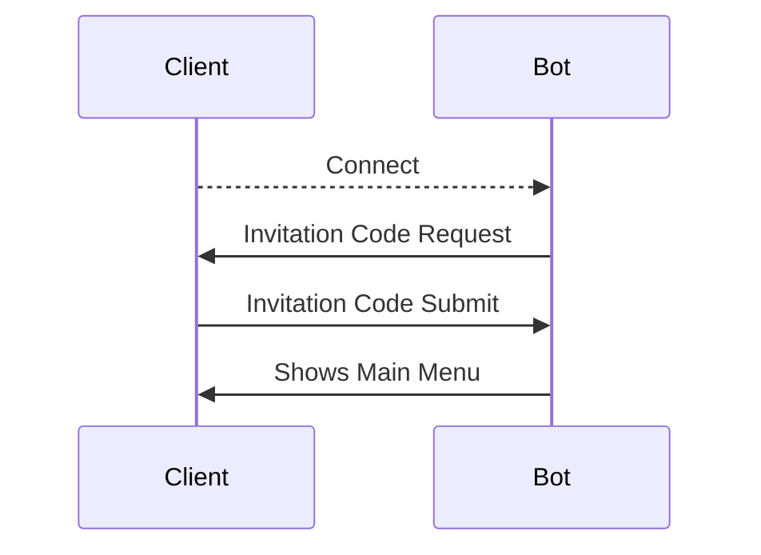
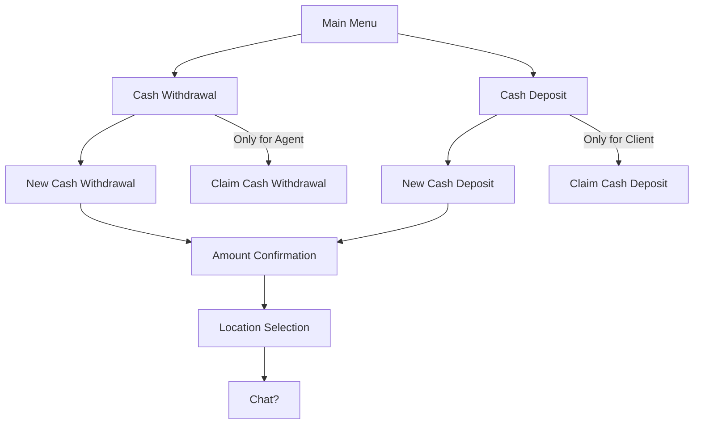
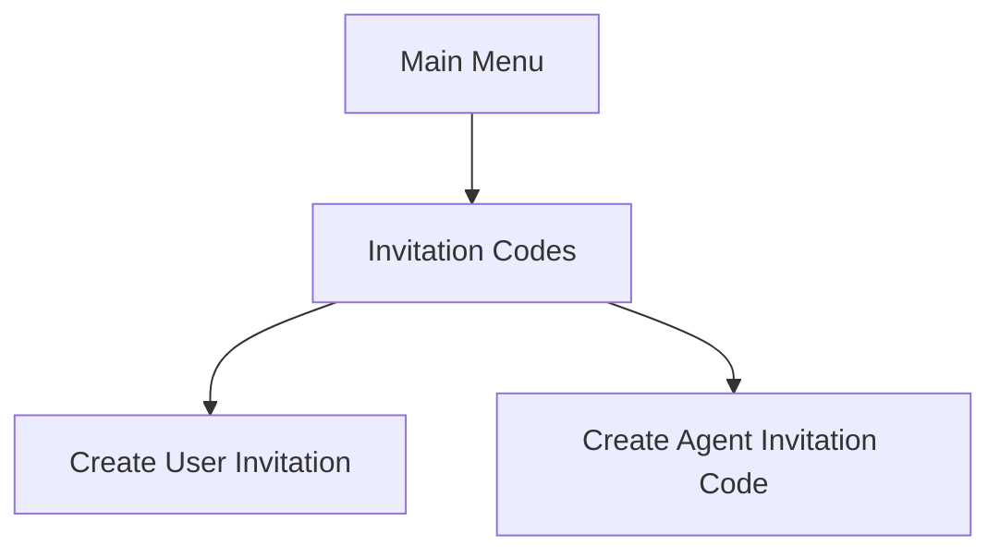

# Stable Coin Remittance System

## Design Rationale

### Main Client Workflow

#### Deposit Sequence

#### Withdrawal Sequence

### Telegram Bot Features

#### Registration

Telegram bots by design can be found and started by anyone, however the bot can stay inactive until it can confirm with Telegram user either invite code or some sort of passphrase. 

#### Telegram Bot Activation Sequence

#### Bot Main Menu

Main Menu is only shown for activated user (the one who presented invitation code).

#### Bot Admin Menu

## Stable Coin (Token) Requirements

Stable coin is a TRC20-compliant token based on TRC20 Mintable and Burnable Contract with Role-based Access Control System.

### Implemented methods and features

#### Basic features

The contract should provide methods and functions to retrieve Token parameters for anyone (aka Public methods):

- Name `trc20.name`
- Symbol `trc20.symbol`
- Decimal places `trc20.decimals`
- Total Supply `trc20.totalSupply`
- Balance for specified address `trc20.balanceOf`

#### Token owner features

The contract should provide methods and function to perform _transfer_ and _approve_ operations with Tokens:

- Transfer `trc20.transfer`
- Allowance (show remaining approved tokens) `trc20.allowance`
- Approve (allowance for third party to transfer specified amount of tokens) `trc20.approve`
- Transfer From Third Party Address (transfer Tokens within remaining pre-approved allowance) `trc20.transferFrom`
- Increase Allowance `trc20.increaseAllowance`
- Decrease Allowance `trc20.decreaseAllowance`

#### Token management features

The contract should allow designated managers to mint, burn, add minters, remove minters, pause or unpause contract:

- Mint `trc20.mint`
- Burn `trc20.burn`
- Burn From Address `trc20.burnFrom`
- Pause `trc20.pause`
- Unpause `trc20.unpause`
- Add Minter `trc20.addMinter`
- Renounce Minter `trc20.renounceMinter`
